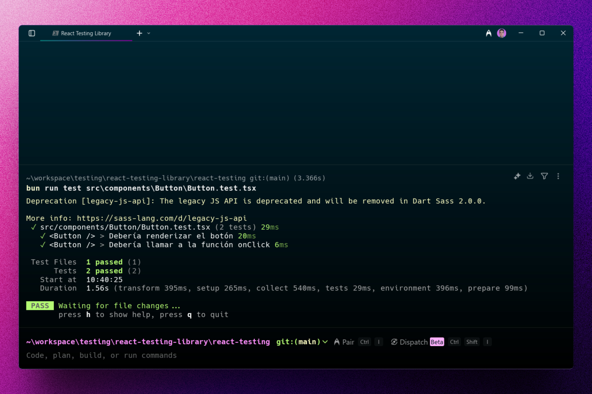
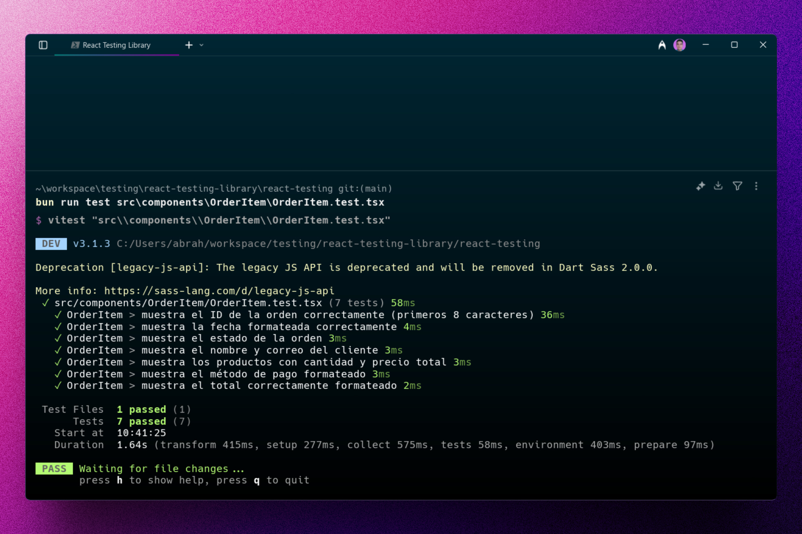
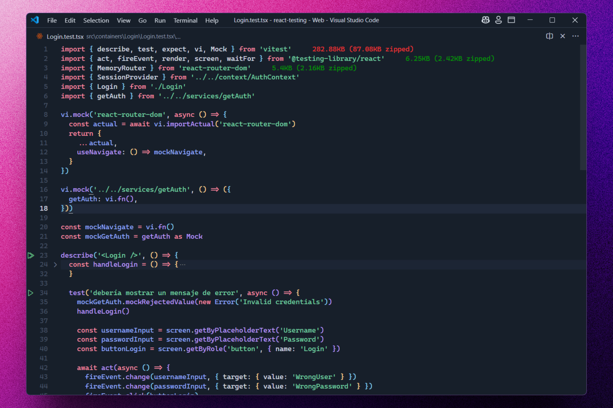

<div align='center'>

# 🧪 Vitest: React Testing Library course

</div>

### Curso completado para aprender testing en React con Vitest y Testing Library.







## 🚀 Descripción

Este repositorio contiene todo el código del curso que he completado para aprender testing en React con Vitest y Testing Library.

Haciendo unit tests, mocks de funciones y módulos, spy, msw y muchas cosas más. 

## ⚡ Comenzar

### Prerrequisitos

1. Git.
2. Node.js: cualquier versión a partir de la 18 o superior.
3. Bun: opcional, pero recomendado.

## 🔧 Instalación

### Usando npm

1. **Clona el repositorio:**

   ```bash
   git clone https://github.com/abrahamgalue/react-testing.git
   cd react-testing
   ```

2. **Instala las dependencias:**

   ```bash
   npm install
   ```

### Ejecución de tests

Puedes acceder a las diferentes carpetas y ejecutar los tests

1. **Ejecuta los tests:**

   ```bash
   npm run test
   ```

### Usando bun

1. **Clona el repositorio:**

   ```bash
   git clone https://github.com/abrahamgalue/react-testing.git
   cd react-testing
   ```

2. **Instala las dependencias:**

   ```bash
   bun install
   ```

### Ejecución de tests

Puedes acceder a las diferentes carpetas y ejecutar los tests

1. **Ejecuta los tests:**

   ```bash
   bun run test
   ```

   Te recomiendo revisar los archivos `.test.ts|x` de las diferentes carpetas para revisar los archivos que puedes usar para ejecutar los tests.

## 🎭 Tecnologías

- [**Vitest**](https://vitest.dev/) Como test runner.
- [**happy-dom**](https://www.npmjs.com/package/happy-dom) Para simular el DOM.
- [**@testing-library/react**](https://testing-library.com/docs/react-testing-library/intro/) Para pruebas de componentes de React.
- [**@testing-library/react-hooks**](https://react-hooks-testing-library.com/) Para pruebas de hooks de React.
- [**msw**](https://mswjs.io/) Para mockear peticiones HTTP.
- [**Vite**](https://vite.dev/) Como bundler.


## 📚 Documentación

Esta es la aplicación base que he utilizado a lo largo del curso. Y a la cual le he aplicado los tests.

👇 Aquí debajo tienes su documentación:

<br/>

# Task Management Project for React Testing Course

## Description

This project is a task management web application developed with React and Vite, specifically designed as teaching material for a course on testing in React. The application allows users to create, edit, delete, and organize tasks, as well as authenticate to maintain their personalized task lists.

The main objective of this project is to provide a practical environment for learning and applying testing techniques in React using react-testing-library. Throughout the course, students will learn to write unit and integration tests for various components and functionalities of the application, thus improving their skills in developing robust and maintainable software.

Key features that will be used for testing demonstrations include:

- User authentication
- CRUD operations for tasks
- Global state management
- API calls (simulated with json-server)
- Conditional rendering and error handling

Through this project, students will gain hands-on experience in writing effective tests, using mocks, and simulating user interactions, all within the context of a real and functional React application.

## Main Features

- User authentication
- CRUD for tasks (Create, Read, Update, Delete)
- Intuitive and responsive user interface
- Mock API with json-server for local development

## User accounts

1. **superadmin**

   - Email: superadmin@example.com
   - Password: superadmin123!

2. **visualizer1**

   - Email: visualizer1@example.com
   - Password: vis1pass456@

3. **visualizer2**

   - Email: visualizer2@example.com
   - Password: vis2pass789#

4. **visualizer3**

   - Email: visualizer3@example.com
   - Password: vis3pass101$

5. **visualizer4**

   - Email: visualizer4@example.com
   - Password: vis4pass202%

6. **Unknown User**
   - Email: awdadw
   - Password: dawwda

## Technologies

- React
- Vite
- SCSS Modules
- JSON Server (para mock API)

## Prerequisites

- Node.js (version 20.15.1 or higher)
- npm or yarn

## Installation

Install dependencies:

```
yarn
```

or if you use npm:

```
npm install
```

## Running the development server

To start both the development server and the mock API, run:

```
yarn start
```

or if you use npm:

```
npm run start
```
